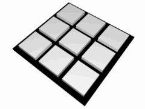

# Jogo da velha

O jogo da velha (português brazileiro) ou jogo do galo(português europeu) ou três em linha é um jogo e/ou passatempo popular. É um jogo de regras extremamente simplés, que não traz grandes dificuldades para seus jogadores e é facilmente aprendido. A origem é desconhecida, com indicações de que pode ter começando no antigo Egipto, onde foram encontrados tabuleiros esculpidos na rocha, que teriam mais de 3.500 anos. De alguma forma, é um jogo "aparentando" dos "Merels".  

Algumas lendas urbanas contam que o jogo terá nascido em Portugal, na cidade de Almeda no ano 545. No entanto, só foi popularizad no ano 1500, pelo descobridor Pedro Álvares Cabral, que adorava jogar este jogo durante as suas viagens. Álvares Cabral terá decidido que este jogo seria o primeiro a ser ensinado ao povo indígenna no Brazil.

O jogo pode ser jogado sobre um tabuleiro ou mesmo sendo riscado sobre um pedaço de papel ou mesa. O menor tabuleiro do mundo foi feito com ADN. 

Empate (chamado de velha no Brazil, costuma-se dizer que o jogo "deu velha"): 

## Estratégias 

Analisando o número de possibilidades de forma simplista, existem 362.880 (ou 9!) maneiras de se dispor a cruz no tabuleiro, sem considerar jogadas vencedoras. Quando consideramos as combinações vencedoras, existem 255.168 jogos possíveis. Assumindo que 'X' inicia o jogo (se considerar que 'O' inicia, os resultados passam a ser inversos), temos:

    131.184 jogos finalizados são ganhos por 'X'
        1.440 são ganhos por 'X' após 5 movimentos
        47.952 são ganhos por 'X' após 7 movimentos
        81.792 são ganhos por 'X' após 9 movimentos
    77.904 jogos finalizados são ganhos por 'O'
        5.328 são ganhos por 'O' após 6 movimentos
        72.576 são ganhos por 'O' após 8 movimentos
    46.080 jogos finalizados resultam em empate

Ignorando jogadas simétricas (outras jogadas rotacionais ou refletidas), existem apenas 138 resultados únicos. Assumindo novamente que 'X' sempre inicia o jogos, temos:

    91 resultados únicos são ganhos por 'X'
        21 são ganhos por 'X' após 5 movimentos
        58 são ganhos por 'X' após 7 movimentos
        12 são ganhos por 'X' após 9 movimentos
    44 resultados únicos são ganhos por 'O'
        21 são ganhos por 'O' após 6 movimentos
        23 são ganhos por 'O' após 8 movimentos
    3 resultados únicos são empates

## Jogada perfeita

Se os dois jogadores jogarem sempre da melhor forma, o jogo terminará sempre em empate. A lógica do jogo é muito simples, de modo que não é difícil deduzir ou decorar todas as possibilidades para efetuar a melhor jogada - apesar de o número total de possibilidades ser muito grande, a maioria delas é simétrica, além de que as regras são simples. Por esse motivo, é muito comum que o jogo empate (ou "dê velha"). 

Um jogador pode facilmente jogar um jogo perfeito seguindo as seguintes regras,[3] por ordem de prioridade:
Em geral, é melhor jogar no centro e em seguida nos cantos pois há maior possibilidade de bloquear ou vencer.

    1. Ganhar: Se você tem duas peças numa linha, ponha a terceira.
    2. Bloquear: Se o oponente tiver duas peças em linha, ponha a terceira para bloqueá-lo.
    3. Triângulo: Crie uma oportunidade em que você poderá ganhar de duas maneiras.
    4. Bloquear o Triângulo do oponente:

        Opção 1: Crie 2 peças em linha para forçar o oponente a se defender, contanto que não resulte nele criando um triângulo ou vencendo. Por exemplo, se 'X' tem dois cantos opostos do tabuleiro e 'O' tem o centro, 'O' não pode jogar num canto (Jogar no canto nesse cenário criaria um triângulo em que 'X' vence).
        Opção 2: Se existe uma configuração em que o oponente pode formar um triângulo, bloqueiem-no.

    5. Centro: Jogue no centro.
    6. Canto vazio: jogue num canto vazio.

Em suma, a não ser em condições especiais, o jogador deve ter preferência pela posição central, seguida pelos cantos, seguidos pelas bordas.
Triangulação

Como não existe estratégia vencedora no jogo da velha, conquistar um triângulo depende de um erro do adversário. Entretanto, algumas delas são definidas através de uma única jogada do adversário.

### Triangulação através do centro

    Comece jogando no centro do tabuleiro.
    Se o adversário jogar na borda, jogue no canto ao lado desta borda.
    O adversário será obrigado a se defender, jogando no canto afastado.
    Estabeleça o triângulo, jogando no canto ou borda alinhados ao canto conquistado.

### Triangulação através do canto

    Comece pelo canto.
    Se o adversário jogar numa borda, jogue no canto que obrigue o adversário a jogar em outra borda.
    Quando o adversário se defender jogando na borda, conquiste o centro.
    Ao conquistar o centro, o triângulo estará formado.

## Regras do Jogo da Velha

    O tabuleiro  é uma matriz  de três linhas por três colunas.
    Dois jogadores escolhem uma marcação cada um, geralmente um círculo (O) e um xis (X).
    Os jogadores jogam alternadamente, uma marcação por vez, numa lacuna que esteja vazia.
    O objectivo é conseguir três círculos ou três xis em linha, quer horizontal, vertical ou diagonal , e ao mesmo tempo, quando possível, impedir o adversário de ganhar na próxima jogada.
    Quando um jogador conquista o objetivo, costuma-se riscar os três símbolos.

Se os dois jogadores jogarem sempre da melhor forma, o jogo terminará sempre em empate.

A lógica do jogo é muito simples, de modo que não é difícil deduzir ou decorar todas as possibilidades para efetuar a melhor jogada – apesar de o número total de possibilidades ser muito grande, a maioria delas é simétrica, além de que as regras  são simples.

Por esse motivo, é muito comum que o jogo empate (ou “dê velha”).

    Ganhar: Se você tem duas peças numa linha, ponha a terceira.
    Bloquear: Se o oponente tiver duas peças em linha, ponha a terceira para bloqueá-lo.
    Triângulo: Crie uma oportunidade em que você poderá ganhar de duas maneiras.
    Bloquear o Triângulo do oponente
    Centro: Jogue no centro.
    Canto vazio: jogue num canto vazio.

### OBS: 
        
    As regras da minha aplicação ao inserir posição exigem que essas mesmas posições devem ser númericos inteiros que vão de 1-9

